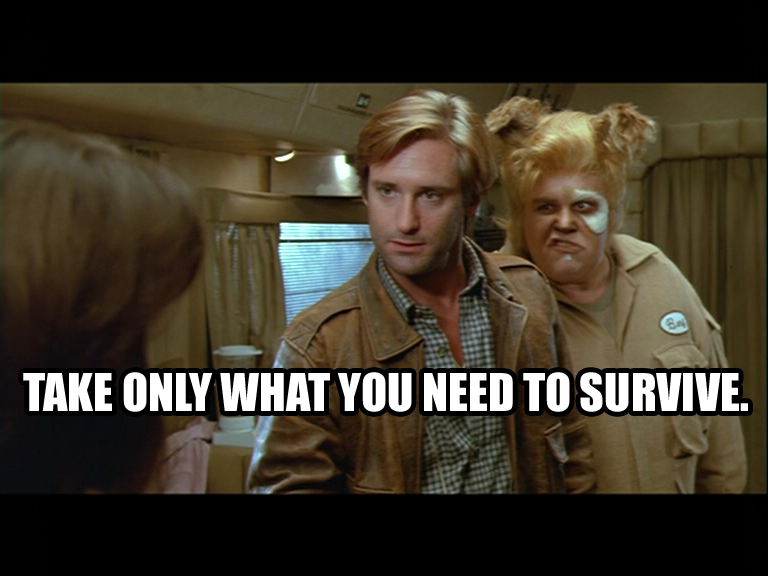

# Go Makes Things Simple

If you have built a web application before, you surely know that there are quite a lot of concepts to keep in your head. HTTP, HTML, CSS, JSON, databases, sessions, cookies, forms, middleware, routing and controllers are just a few among the many things your web app *may* need to interact with.

While each one of these things *can be important* in the building of your web applications, not every one of them *is important* for any given app. For instance, a web API may just use JSON as it's serialization format, thus making concepts like HTML not relevant for that particular web app.

## The Go Way

The Go community understands this dillema. Rather than rely on large, heavyweight frameworks that try to cover all the bases, Go programmers pull in the bare necessities to get the job done. This minimalist approach to web programming may be offputting at first, but the result of this effort is a much simpler program in the end.

**Go makes things simple,** it's as easy as that. If we train ourselves to align with the *"Go way"* of programming for the web, we will end up with more **simple**, **flexible**, and **maintainable** web applications.

## Power in Simplicity

As we go through the exercises in this book, I think you will be suprised by how simple some of these programs can be whilst still affording a bunch of functionality.

When sitting down to craft your own web applications in Go, think hard about the components and concepts that your app will be focused on, and use just those pieces. This book will be covering a wide array of web topics, but do not feel obligated to use them all. In the words of our friend Lonestar, *"Take only what you need to survive"*.

