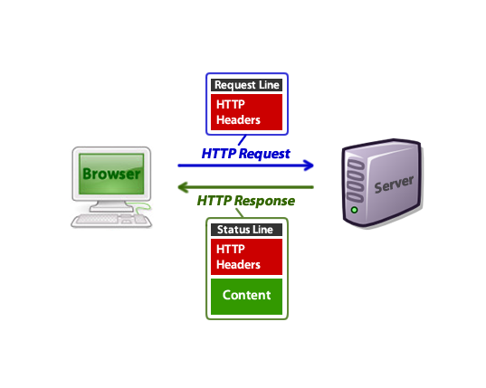

# The net/http Package
You have probably heard that Go is fantastic for building web applications of
all shapes and sizes. This is partly due to the fantastic work that has been
put into making the standard library clean, consistent, and easy to use.

Perhaps one of the most important packages for any budding Go web developer is
the `net/http` package. This package allows you to build HTTP servers in Go
with its powerful compositional constructs. Before we start coding, let's do
an extremely quick overview of HTTP.

## HTTP Basics
When we talk about building web applications, we usually mean that we are
building HTTP servers. HTTP is a protocol that was originally designed to
transport HTML documents from a server to a client web browser. Today, HTTP is
used to transport a whole lot more than HTML.



The important thing to notice in this diagram is the two points of interaction
between the *Server* and the *Browser*. The *Browser* makes an HTTP request
with some information, the *Server* then processes that request and returns a
*Response*.

This pattern of request-response is one of the key focal points in building web
applications in Go. In fact, the `net/http` package's most important piece is
the `http.Handler` Interface.

## The http.Handler Interface
As you become more familiar with Go, you will notice how much of an impact
*interfaces* make in the design of your programs. The `net/http` interface
encapsulates the request-response pattern in one method:

``` go
type Handler interface {
    ServeHTTP(ResponseWriter, *Request)
}
```

Implementors of this interface are expected to inspect and process data coming
from the `http.Request` object and write out a response to the
`http.ResponseWriter` object.

The `http.ResponseWriter` interface looks like this:

```
type ResponseWriter interface {
    Header() Header
    Write([]byte) (int, error)
    WriteHeader(int)
}
```

## Composing Web Services
Because much of the `net/http` package is built off of well defined interface
types, we can (and are expected to) build our web applications with composition
in mind. Each `http.Handler` implementation can be thought of as its own web
server.

Many patterns can be found in that simple but powerful assumption. Throughout
this book we will cover some of these patterns and how we can use them to solve
real world problems.


## Exercise: 1 Line File Server
Let's solve a real world problem in 1 line of code.

Most of the time people just need to serve static files. Maybe you have a
static HTML landing page and just want to serve up some HTML, images, and CSS
and call it a day. Sure, you could pull in apache or Python's
`SimpleHTTPServer`, but Apache is too much for this little site and
`SimpleHTTPServer` is, well, too slow.

We will begin by creating a new project in our `GOPATH`.

``` bash
cd GOPATH/src
mkdir fileserver && cd fileserver
```

Create a **main.go** with our typical go boilerplate.

``` go
package main

import "net/http"

func main() {
}
```

All we need to import is the `net/http` package for this to work. Remember
that this is all part of the standard library in Go.

Let's write our fileserver code:

``` go
http.ListenAndServe(":8080", http.FileServer(http.Dir(".")))
```

The `http.ListenAndServe` function is used to start the server, it will bind to
the address we gave it (`:8080`) and when it receives an HTTP request, it will
hand it off to the `http.Handler` that we supply as the second argument. In our
case it is the built-in `http.FileServer`.

The `http.FileServer` function builds an `http.Handler` that will serve an
entire directory of files and figure out which file to serve based on the
request path. We told the FileServer to serve the current working directory
with `http.Dir(".")`.

The entire program looks like this:

``` go
package main

import "net/http"

func main() {
    http.ListenAndServe(":8080", http.FileServer(http.Dir(".")))
}
```

Let's build and run our fileserver program:
``` bash
go build
./fileserver
```

If we visit `localhost:8080/main.go` we should see the contents of our
**main.go** file in our web browser. We can run this program from any directory
and serve the tree as a static file server. All in 1 line of Go code.
